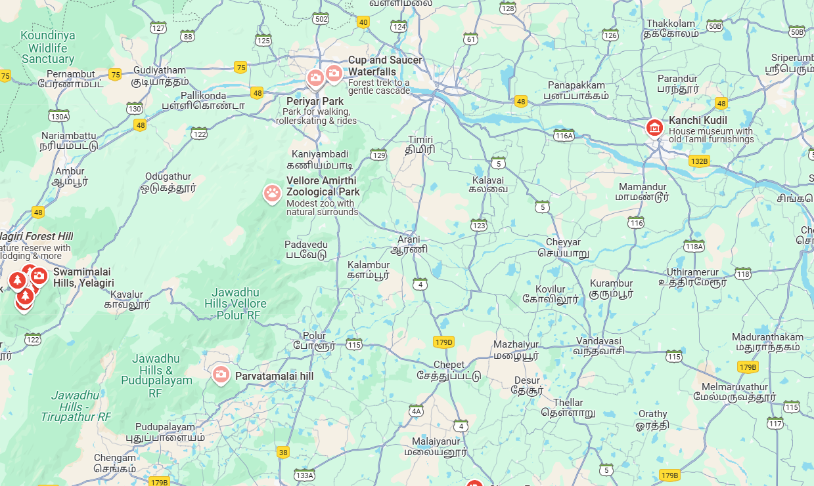

# Ex04 Places Around Me
## Date: 23/04/2025

## AIM
To develop a website to display details about the places around my house.

## DESIGN STEPS

### STEP 1
Create a Django admin interface.

### STEP 2
Download your city map from Google.

### STEP 3
Using ```<map>``` tag name the map.

### STEP 4
Create clickable regions in the image using ```<area>``` tag.

### STEP 5
Write HTML programs for all the regions identified.

### STEP 6
Execute the programs and publish them.

## CODE
```
map.html
<html>

<head>

<title>My City</title>

</head>

<body>

<h1 align="center">

<font color="red"><b>arani</b></font>

</h1>

I

<h3 align="center">

<font color="green"><b>sanjaiganth.B (212224230244)</b></font>

</h3>

<center>



<map name="MyCity">

<area shape="rect" coords="645,379,602,364" href="home.html" title="My home town">
<area shape="rect" coords="531,117,607,105" href="falls.html" title="cup and saucer waterfalls">
<area shape="rect" coords="403,314,423,312" href="zoo.html" title="amirti zoo">
<area shape="rect" coords="464,140,487,144" href="fort.html" title="vellore Fort">
<area shape="rect" coords="353,584,323,586" href="hills.html" title="paravatamalai hills">


</map>

</center>

</body>

</html>
home.html
<html>
    <head>
        <title>My City</title>
    </head>
    <body>
        <h1 align="center">
            <font color="red"><b>arani</b></font>
        </h1>
        <h2 align="center">
            <font color="green"><b>home town</b></font>
        </h2>
        <br>
        <hr size="3" color="green">
        <br>
        <center></center>
        <p align="justify">
            <font face="Georgia" size="5" color="black">
            
            <br>
            <br>
            Arani (also spelled Aarani) is a historic town in the Tiruvannamalai district of Tamil Nadu, India. It is well known for its rich silk weaving industry, producing high-quality Arni silk sarees that are famous across the state. Arni is located on the banks of the Kamandalan River and has a strong cultural and traditional background. It's also close to the holy city of Tiruvannamalai, known for the Arunachaleswarar Temple. Arni serves as a commercial hub for nearby villages and plays an important role in Tamil Nadu’s handloom and textile heritage.

        </font>
        </p>
    </body>
</html>
fort.html
<html>
    <head>
        <title>My City</title>
    </head>
    <body>
        <h1 align="center">
            <font color="red"><b>arani</b></font>
        </h1>
        <h2 align="center">
            <font color="green"><b>vellore Fort</b></font>
        </h2>
        <br>
        <hr size="3" color="green">
        <br>
        <center></center>
        <p align="justify">
            <font face="Georgia" size="5" color="black">
           
            <br>
            <br>
            Vellore Fort is a historic fort located in Vellore, Tamil Nadu. Built in the 16th century by the Vijayanagara kings, it is famous for its massive granite walls, wide moat, and rich history. The fort has seen the rule of several dynasties including the Bijapur Sultans, the Marathas, the Carnatic Nawabs, and the British. Inside the fort, you'll find important structures like the Jalakandeswarar Temple, a church, and a mosque, showing its multi-religious heritage. It also played a role during the Vellore Mutiny of 1806, one of the first uprisings against British rule in India.

 </font>
        </p>
    </body>
</html>
zoo.html
<html>
    <head>
        <title>My City</title>
    </head>
    <body>
        <h1 align="center">
            <font color="red"><b>arani</b></font>
        </h1>
        <h2 align="center">
            <font color="green"><b>amirthi zoo</b></font>
        </h2>
        <br>
        <hr size="3" color="green">
        <br>
        <center></center>
        <p align="justify">
            <font face="Georgia" size="5" color="black">
           
            <br>
            <br>
            
            Amirthi Zoological Park is located near Vellore, Tamil Nadu, at the foot of the Javadi Hills. It's a popular eco-tourism spot that features a variety of animals, birds, and reptiles in a natural environment. The zoo is surrounded by forests, making it a perfect place for nature lovers and school trips. A small waterfall and trekking trails nearby add to its charm, making it both educational and refreshing.


 </font>
        </p>
    </body>
</html>
falls.html
<html>
    <head>
        <title>My City</title>
    </head>
    <body>
        <h1 align="center">
            <font color="red"><b>arani</b></font>
        </h1>
        <h2 align="center">
            <font color="green"><b>cup and saucer water falls</b></font>
        </h2>
        <br>
        <hr size="3" color="green">
        <br>
        <center></center>
        <p align="justify">
            <font face="Georgia" size="5" color="black">
           
            <br>
            <br>
            
            The Cup and Saucer Waterfalls is a hidden gem near Vellore. As the name suggests, the shape of the rock formations around the waterfall looks like a cup and saucer, giving it its unique name. Surrounded by lush greenery, it's a peaceful spot ideal for short treks and relaxing by nature. Though not very commercialized, it's loved by locals and perfect for a quiet escape.


 </font>
        </p>
    </body>
</html>
hills.html
<html>
    <head>
        <title>My City</title>
    </head>
    <body>
        <h1 align="center">
            <font color="red"><b>arani</b></font>
        </h1>
        <h2 align="center">
            <font color="green"><b>paravathamalai hills</b></font>
        </h2>
        <br>
        <hr size="3" color="green">
        <br>
        <center></center>
        <p align="justify">
            <font face="Georgia" size="5" color="black">
           
            <br>
            <br>
            
            Parvathamalai is a sacred mountain located near Polur in Tiruvannamalai district. It is known for its steep, adventurous trek and the ancient Shiva temple at the peak. Devotees believe that the hill has divine energy, and many visit for spiritual experiences. The path includes iron rod ladders and stone steps, making it a thrilling climb. The breathtaking view from the top, especially during sunrise or sunset, is truly unforgettable.


 </font>
        </p>
    </body>
</html>
```


## OUTPUT


## RESULT
The program for implementing image maps using HTML is executed successfully.
